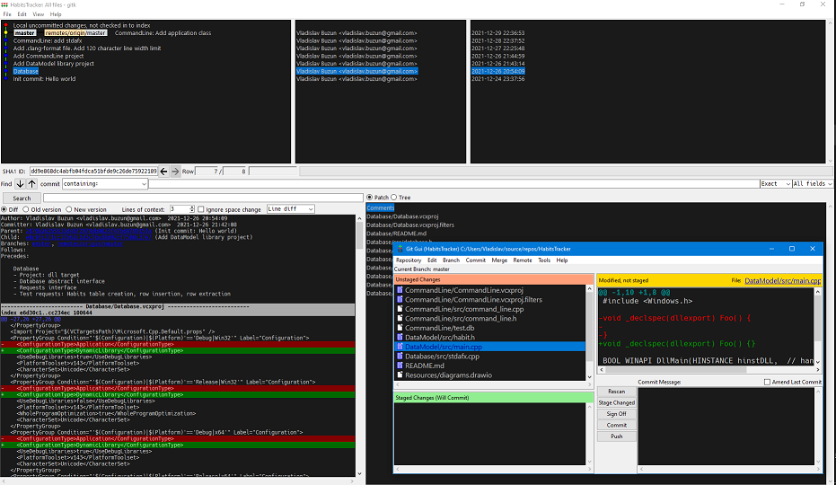

# .gitconfig

[Git (1.7.10+)](https://git-scm.com/docs/git-config#_includes) supports including files.  
Host-specific ```.gitconfig``` example:
```
[user]
	name = <Your name>
	email = <Your email>

[include]
	path = <This repo>/git/.gitconfig
```

# git-gui

## Dark theme:
Windows path: ```C:\Program Files\Git\mingw64\share\git-gui\lib\themed.tcl```  
Open with text editor, find function below and change variable values
```
proc sync_with_theme {} {
	set base_bg             #282a36
	set base_fg             #f8f8f2
	set text_bg             #282a36
	set text_fg             #f8f8f2
	set select_bg           #f8f8f2
	set select_fg           #282a36
	set inactive_select_bg	[convert_rgb_to_gray $select_bg]
	set inactive_select_fg	$select_fg
```

## Fonts
||Font|Style|Size|
|---|---|---|---|
|Main font|Segoe UI|Regular|12|
|Diff/Console Font|Hack|Regular|12|

# gitk
> TODO: config file

## Colors
||RGB|
|---|---|
|Interface          |64  64  64|
|Background         |26  26  26|
|Foreground         |204 204 204|
|Diff: old lines    |255 155 155|
|Diff: old lines bg |130 0   0|
|Diff: new lines    |150 255 150|
|Diff: new lines bg |0   106 0|
|Diff: hunk header  |72  72  255|
|Select bg          |0   110 200|

## Fonts
||Font|Style|Size|
|---|---|---|---|
|Main font|Segoe UI|Regular|10|
|Diff display font|Hack|Regular|9|
|User interface font|Segoe UI|Regular|10|

# Example

